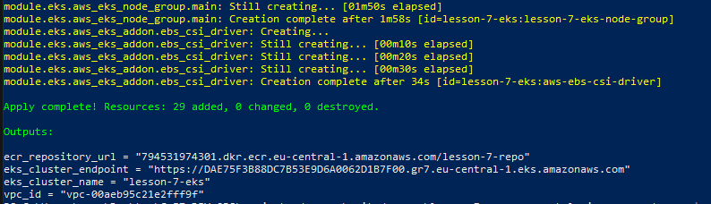
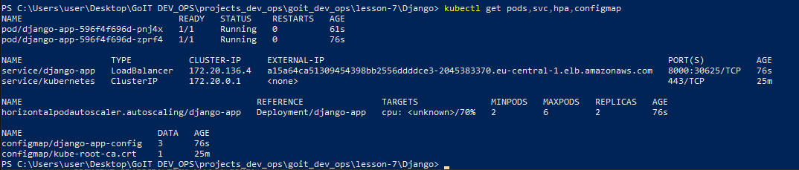
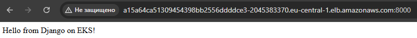

# Урок 7: Розгортання Django в EKS за допомогою Terraform, AWS CLI та Helm

Цей репозиторій містить інфраструктуру та Helm-чарт для розгортання Django-додатка в Kubernetes (Amazon EKS) 

## 🎯 Що реалізовано
- **Terraform:** створення VPC, підмереж, ECR репозиторію та EKS кластера.
- **ECR:** репозиторій для зберігання нашого Docker image.
- **EKS:** кластер Kubernetes для розгортання додатку.
- **Helm chart:** створення `Deployment` з прив'язкою `envFrom` до `ConfigMap`, створено `Service` (LoadBalancer) та `HPA` (Horizontal Pod Autoscaler).

---

## 🚀 Інструкція із запуску

### Крок 0. Отримання ключів доступу (IAM) в AWS
Для роботи Terraform та AWS CLI на вашому комп'ютері потрібні ключі доступу.

1. Увійдіть у веб-консоль AWS і в пошуку відкрийте сервіс **IAM**.
2. Перейдіть до розділу **Users** (Користувачі) і натисніть **Create user**.
3. Введіть ім'я користувача (наприклад, `devops-admin`) і перейдіть далі (Next).
4. Оберіть **"Attach policies directly"** і додайте політику **AdministratorAccess**. Натисніть **Create user**.
5. Відкрийте створеного користувача, перейдіть на вкладку **Security credentials** (Облікові дані безпеки).
6. Прокрутіть до розділу **Access keys** (Ключі доступу) і натисніть **Create access key**.
7. Оберіть варіант **Command Line Interface (CLI)** і підтвердіть створення.
8. **ОБОВ'ЯЗКОВО!** Скопіюйте показані `Access key ID` та `Secret access key` (або завантажте .csv файл), оскільки `Secret` більше ніколи не буде показаний.

Після отримання ключів відкрийте термінал і введіть:
```powershell
aws configure
```
Вставте ключі та вкажіть ваш регіон (наприклад, `eu-central-1`). Формат виводу можна залишити порожнім або `json`.

---

### Крок 1. Розгортання інфраструктури (Terraform)
Після налаштування `aws configure`, розгортаємо інфраструктуру:

```powershell
# Перейдіть у папку інфраструктури
cd lesson-7

# Ініціалізація та розгортання
terraform init
terraform apply -auto-approve
```
> Після завершення ви отримаєте `ecr_repository_url` та `eks_cluster_name` в output. 

---

### Крок 2. Збірка та завантаження образу в ECR (AWS CLI + Docker)
Отримайте адресу ECR та авторизуйтесь у Docker:

```powershell
# 1. Залогіньтеся в ECR (замініть <REGION> та <ACCOUNT_ID> на свої)
aws ecr get-login-password --region eu-central-1 | docker login --username AWS --password-stdin <ACCOUNT_ID>.dkr.ecr.eu-central-1.amazonaws.com

# 2. Зберіть образ Django (з кореня репозиторію, де лежить папка Django)
cd ../Django
docker build -t lesson-7-repo .

# 3. Додайте тег до образу
docker tag lesson-7-repo:latest <ACCOUNT_ID>.dkr.ecr.eu-central-1.amazonaws.com/lesson-7-repo:latest

# 4. Завантажте образ до ECR
docker push <ACCOUNT_ID>.dkr.ecr.eu-central-1.amazonaws.com/lesson-7-repo:latest
```

---

### Крок 3. Підключення до кластера EKS
Налаштуйте `kubectl` для роботи зі створеним кластером:

```powershell
aws eks update-kubeconfig --region eu-central-1 --name lesson-7-eks
kubectl get nodes
```

---

### Крок 4. Деплой застосунку через Helm
Перед деплоєм обов'язково оновіть свій `repository` в файлі `lesson-7/charts/django-app/values.yaml` (рядок 4) та вкажіть ваш `<ACCOUNT_ID>`.

```powershell
cd ../lesson-7

helm upgrade --install django-app ./charts/django-app
```

---

### Крок 5. Перевірка роботи
Отримайте адресу `LoadBalancer`, за якою доступний застосунок:

```powershell
kubectl get svc django-app
```
> Скопіюйте значення `EXTERNAL-IP` і відкрийте його у браузері разом з портом: `http://<EXTERNAL-IP>:8000`.
example:
http://a15a64ca51309454398bb2556ddddce3-2045383370.eu-central-1.elb.amazonaws.com:8000

Перевірка HPA та ConfigMap:
```powershell
kubectl get hpa
kubectl get configmap django-app-config -o yaml
```

---

## 📸 Результати виконання (Скріншоты)

1. **Термінальний вивід `terraform apply`**


2. **Перевірка робочих Pods, Services, HPA та ConfigMap**


3. **Перевірка робочих django**
http://a15a64ca51309454398bb2556ddddce3-2045383370.eu-central-1.elb.amazonaws.com:8000


## 🧹 Очищення ресурсів
Не забудьте видалити ресурси після перевірки, щоб не платити за AWS:
```powershell
# Викликати з папки lesson-7
terraform destroy -auto-approve
```
