> Цей проект базується на [фінальному проекті GoIT DevOps](https://github.com/EssenceMaks/GoIT_DevOps/tree/goit_dev_ops_final-project)
> та розширює його підтримкою **Universal RDS/Aurora модуля** для гнучкого перемикання між типами Баз Даних.

---

## 🗄️ Universal Aurora / RDS Module

Модуль `modules/rds` є **універсальним** — одним налаштуванням перемикається між:
- ✅ **Standard RDS PostgreSQL** (Free Tier, за замовчуванням)
- 🔄 **AWS Aurora Cluster** (платно, вмикається через feature flag)

### Як переключитися на Aurora

1. Відкрийте `goit-devops-fp/main.tf`, знайдіть блок `module "rds"` та змініть `use_aurora`:

```hcl
module "rds" {
  # ...
  use_aurora     = true            # false = Standard RDS, true = Aurora
  engine         = "aurora-postgresql"
  engine_version = "16.1"
  instance_class = "db.t3.medium"  # Aurora вимагає >= t3.medium
}
```

2. Застосуйте зміни:

```bash
terraform apply
```

> **⚠️ Важливо:** Aurora не входить у Free Tier. Використовуйте лише якщо готові до витрат (~$0.10/год мінімум).

### Особливості реалізації

| Властивість | Деталі |
|---|---|
| **Єдиний модуль** | Один `modules/rds` для обох типів БД |
| **Feature flag** | `use_aurora = true/false` у `main.tf` |
| **Безпека** | Security Groups та Subnets створюються автоматично |
| **Гнучкість** | Підтримка `multi_az` та кастомних параметрів |

---

## 🧪 Результати дослідження Aurora на Free Tier

### Крок 1 — Спроба переключення на Aurora

Змінено `use_aurora = true` → запущено `terraform apply`:

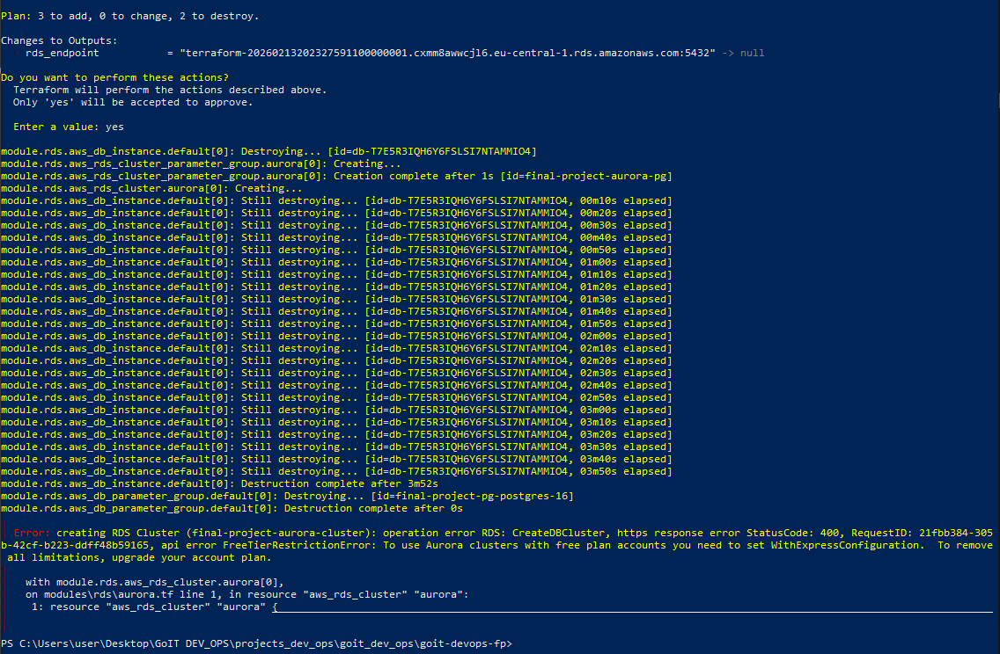

| Питання | Результат |
|---|---|
| Конфігурація написана правильно? | ✅ Так |
| Переключення відбулось? | ❌ Ні |
| Aurora на Free Tier можлива? | ❌ Ні — завжди платна |

**Причина помилки:**

```
FreeTierRestrictionError: To use Aurora clusters with free plan accounts
you need to set WithExpressConfiguration
```

AWS блокує Aurora на Free Tier акаунтах. Параметр `WithExpressConfiguration` — нова можливість AWS API, яку Terraform **поки не підтримує**:

```hcl
# Terraform AWS Provider не має цього параметра:
resource "aws_rds_cluster" "aurora" {
  # with_express_configuration = true  ← недоступно
}
```

> Навіть окремий мінімальний Aurora модуль з 10 рядків коду дасть ту саму помилку — справа в AWS акаунті, не в коді.

### Крок 2 — Повернення до Standard RDS

Повернуто `use_aurora = false` в `main.tf` та `variables.tf` → `terraform apply`:

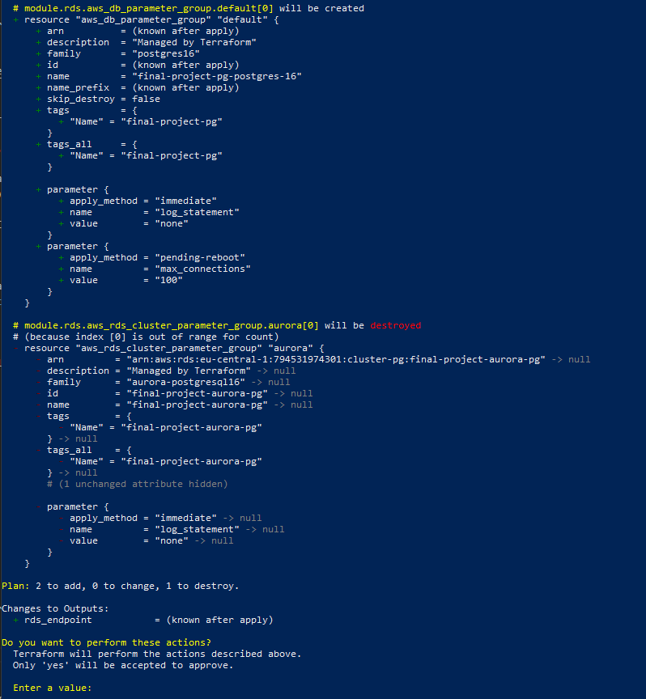
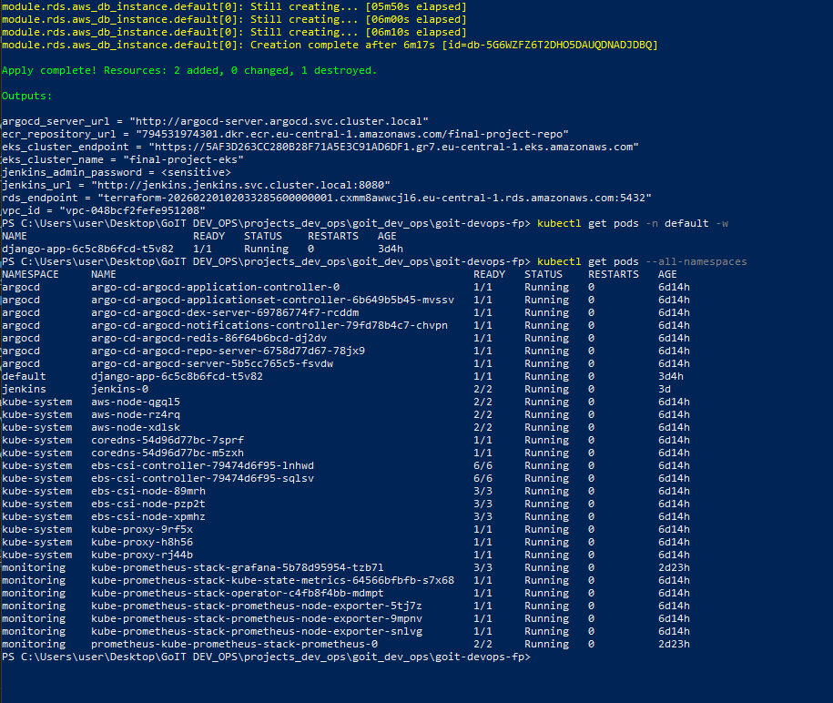
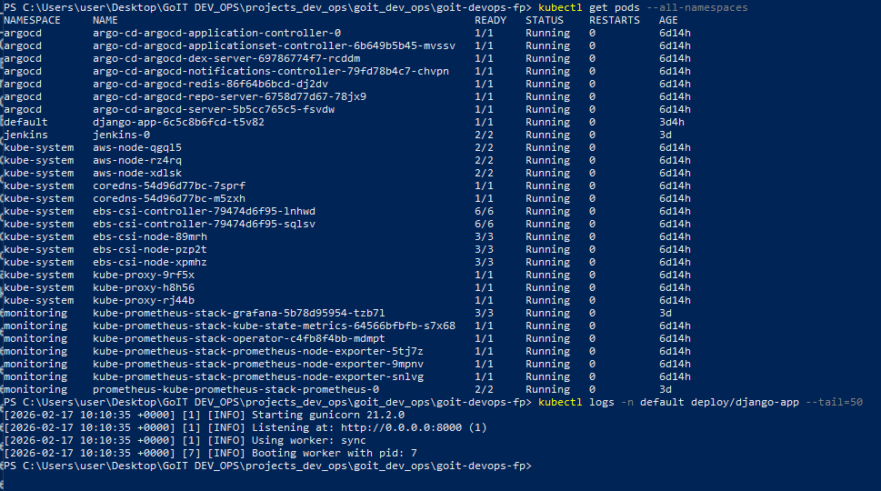

```
Apply complete! Resources: 2 added, 0 changed, 1 destroyed.
rds_endpoint = "terraform-...rds.amazonaws.com:5432"
```

### Крок 3 — Перевірка Django

```bash
kubectl logs -n default deploy/django-app --tail=50
```

```
[INFO] Starting gunicorn 21.2.0
[INFO] Listening at: http://0.0.0.0:8000 (1)
[INFO] Using worker: sync
[INFO] Booting worker with pid: 7
```

✅ **Django успішно підключився до RDS PostgreSQL** — жодних помилок БД.

### Висновок

Модуль відтворено на рівні коду правильно та підтримує обидва режими. Aurora не запустилась виключно через обмеження AWS Free Tier акаунту.
навіть якщо б відтворювати код не через вінальний проект, а з нуля, чи використавши набагато меньший проект, то  результат був би той самий.
---


Склад фінального проекту для швидкого огляду:

# Final Project: CI/CD з Jenkins + Argo CD + Terraform + Helm

Повний CI/CD pipeline для Django застосунку з автоматичним білдом, деплоєм та синхронізацією через GitOps.

## 📸 Скріншоти (Proof of Work)

1. **Jenkins** — сторінка job `django-app` з успішним білдом (зелена галочка)
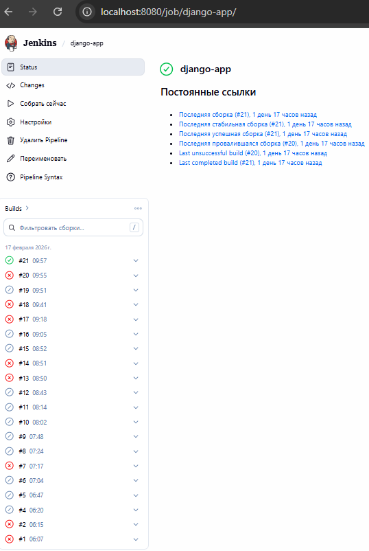

2. **Argo CD** — application `django-app` зі статусом Synced / Healthy
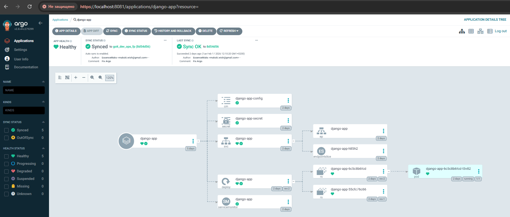

3. **Django App** — відкритий у браузері `http://localhost:8000` з текстом "Hello from Django on EKS!"
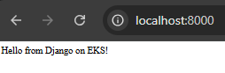

4. **Grafana** — Dashboard з графіками CPU/Memory кластера
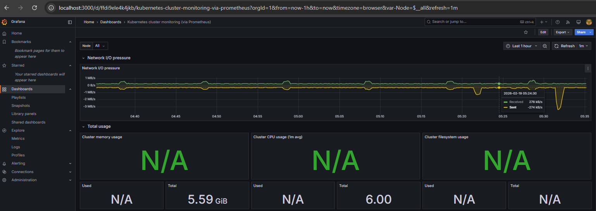
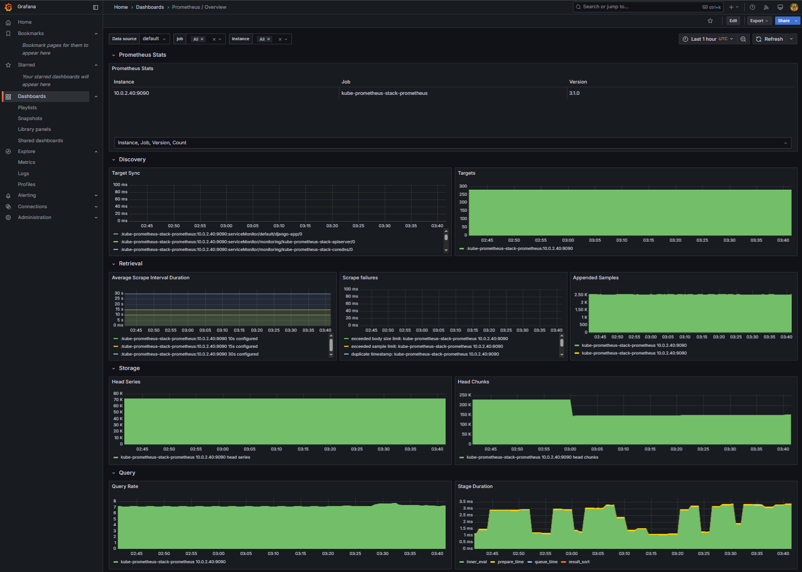

5. **Prometheus** — Status → Targets (всі targets UP)
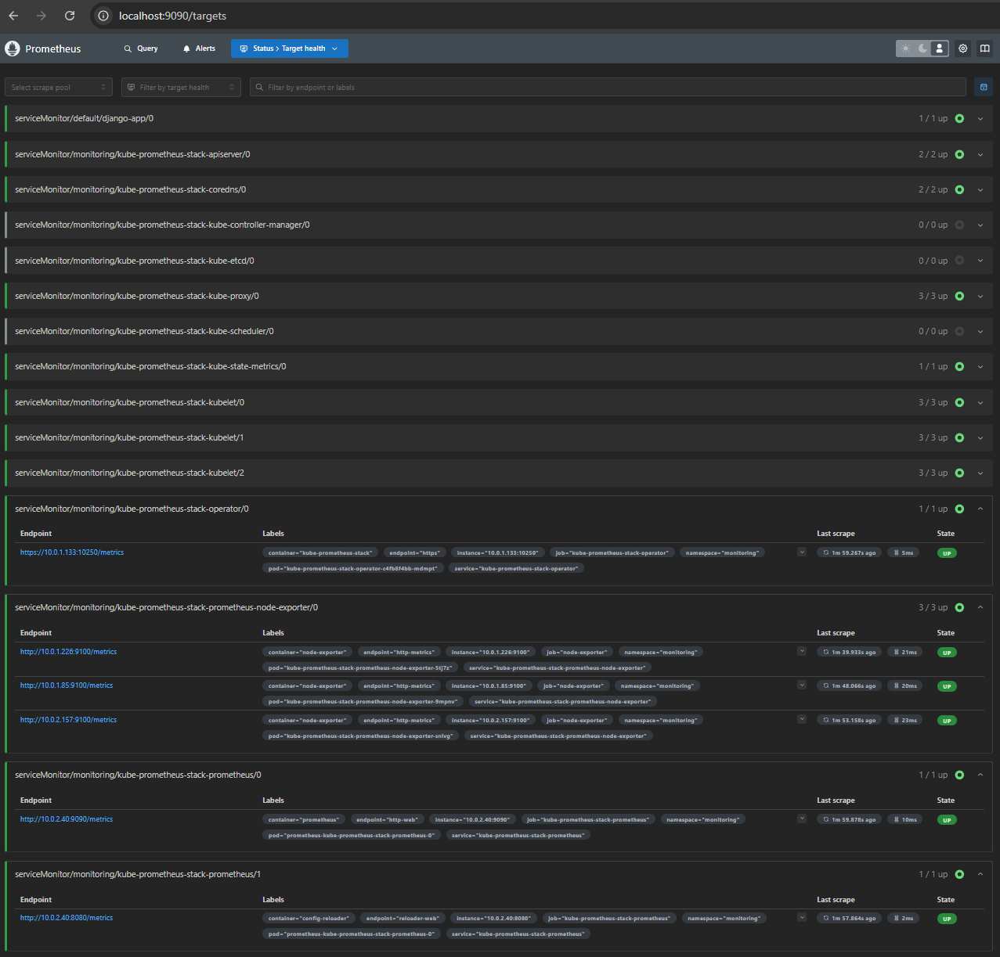
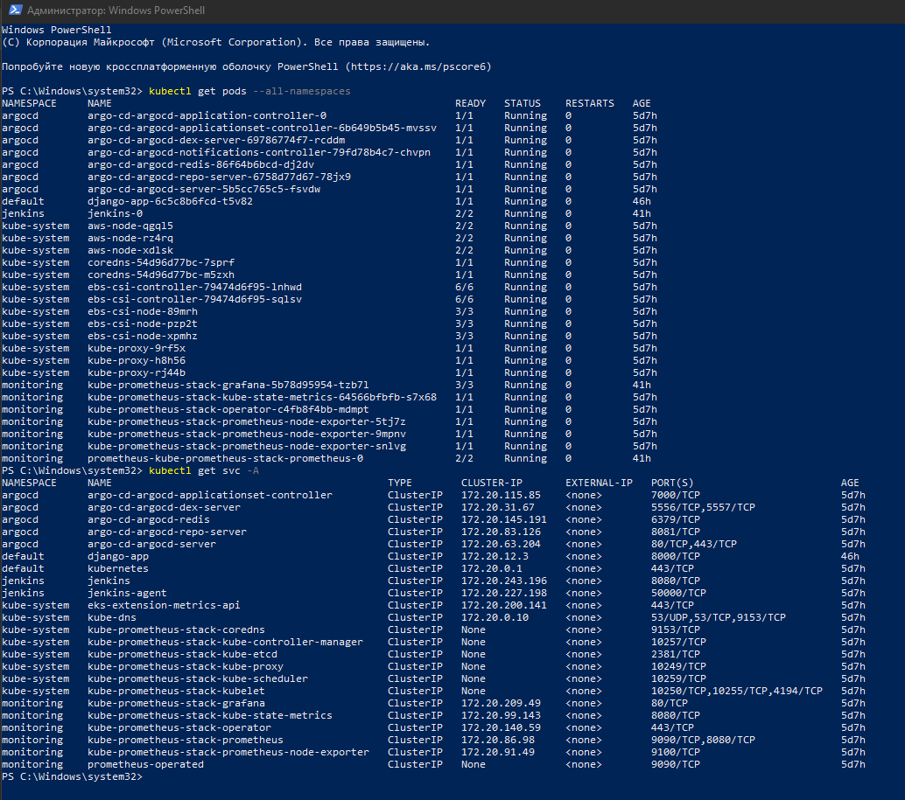

6. **kubectl** — вивід `kubectl get pods --all-namespaces` (всі поди Running)
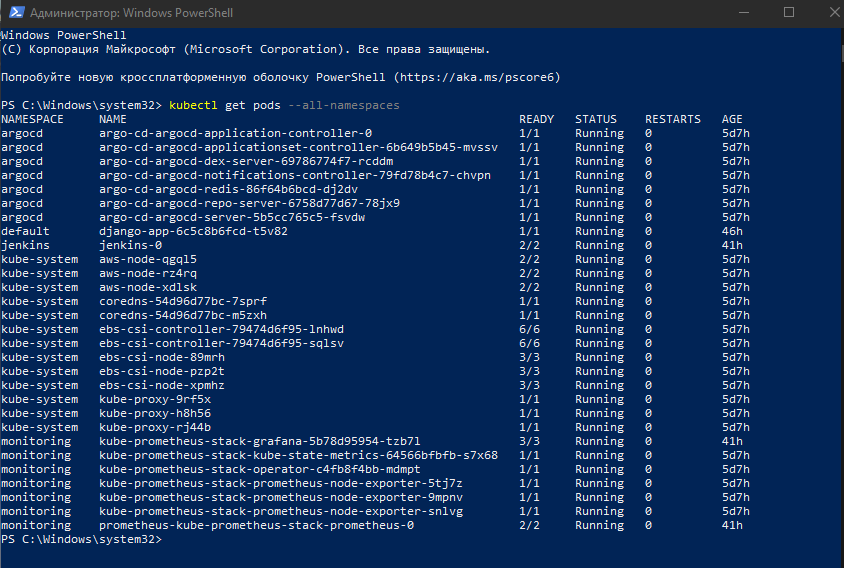

---

## ⚠️ AWS Configuration

**Цей проєкт налаштовано на region `eu-central-1`**

- **EKS Nodes**: 3× `t3.small` (2 vCPU, 2 GB RAM)
- **RDS Instance**: `db.t3.micro` (PostgreSQL 16.6)
- **Monitoring**: Prometheus + Grafana (kube-prometheus-stack)

## 🎯 Що реалізовано

### Інфраструктура (Terraform)

- **S3 + DynamoDB**: Backend для Terraform state
- **VPC**: Публічні та приватні підмережі, Internet Gateway, NAT
- **ECR**: Docker registry для образів
- **EKS**: Kubernetes кластер з EBS CSI Driver
- **RDS**: PostgreSQL база даних
- **Jenkins**: CI сервер (Helm) з Kubernetes plugin для динамічних агентів
- **Argo CD**: GitOps CD інструмент (Helm) з автоматичною синхронізацією
- **Prometheus + Grafana**: Моніторинг кластера та застосунку

### CI/CD Pipeline

1. **Jenkins** збирає Docker образ через **Kaniko** (без Docker-in-Docker)
2. **Jenkins** пушить образ до **ECR**
3. **Argo CD** автоматично виявляє зміни в Git (Helm chart)
4. **Argo CD** синхронізує новий образ в Kubernetes
5. **Prometheus** збирає метрики з Django (`/metrics` endpoint)
6. **Grafana** візуалізує метрики кластера та застосунку

## 📁 Структура проєкту

```
goit-devops-fp/
├── main.tf                      # Головний Terraform файл
├── backend.tf                   # S3 backend конфігурація
├── outputs.tf                   # Outputs всіх модулів
├── variables.tf                 # Змінні проєкту
├── secrets.tfvars               # Секретні змінні (паролі) — НЕ в Git!
├── Django/                      # Django застосунок
│   ├── Dockerfile               # Docker образ для Django
│   ├── Jenkinsfile              # CI pipeline (Kaniko + ECR)
│   ├── requirements.txt         # Python залежності (django-prometheus)
│   └── myproject/               # Django проєкт
├── modules/                     # Terraform модулі
│   ├── s3-backend/              # S3 + DynamoDB для state
│   ├── vpc/                     # VPC, підмережі, IGW, NAT
│   ├── ecr/                     # ECR репозиторій
│   ├── eks/                     # EKS кластер + EBS CSI Driver
│   ├── rds/                     # RDS PostgreSQL
│   ├── jenkins/                 # Jenkins (Helm)
│   ├── argo_cd/                 # Argo CD (Helm) + Applications
│   │   └── charts/              # Helm chart для ArgoCD Applications
│   └── monitoring/              # Prometheus + Grafana (Helm)
└── charts/                      # Helm charts для деплою
    └── django-app/              # Helm chart Django застосунку
        └── templates/
            ├── deployment.yaml
            ├── service.yaml
            ├── configmap.yaml
            ├── secret.yaml
            ├── servicemonitor.yaml  # Prometheus ServiceMonitor
            └── hpa.yaml
```

## 🚀 Інструкція запуску

### Передумови

```powershell
# Перевірте встановлені інструменти
terraform --version   # >= 1.0
aws --version         # AWS CLI v2
kubectl version --client
helm version
git --version

# AWS credentials мають бути налаштовані
aws configure
# Або через змінні середовища: AWS_ACCESS_KEY_ID, AWS_SECRET_ACCESS_KEY
```

### Крок 1: Клонування репозиторію

```powershell
git clone https://github.com/EssenceMaks/GoIT_DevOps.git
cd GoIT_DevOps
git checkout goit_dev_ops_fp
```

### Крок 2: Налаштування змінних

Створіть файл `goit-devops-fp/secrets.tfvars`:

```hcl
db_password            = "ВашПарольБД"
jenkins_admin_password = "ВашПарольJenkins"
grafana_admin_password = "ВашПарольGrafana"
argocd_admin_password  = "ВашПарольArgoCD"
```

Оновіть конфігурації:
- **`Django/Jenkinsfile`** — рядок `registry`: вкажіть ваш ECR URL (`<AWS_ACCOUNT_ID>.dkr.ecr.<REGION>.amazonaws.com/<REPO>`)
- **`modules/argo_cd/charts/values.yaml`** — `repoURL`: URL вашого GitHub репозиторію, `targetRevision`: ваша гілка

### Крок 3: Розгортання інфраструктури

```powershell
cd goit-devops-fp

# 1. Ініціалізація (перший раз — без S3 backend)
terraform init

# 2. Створення S3 backend
terraform apply -target=module.s3_backend -var-file="secrets.tfvars"

# 3. Розкоментуйте backend.tf, потім:
terraform init -migrate-state

# 4. Розгортання всієї інфраструктури (~15-20 хвилин)
terraform apply -var-file="secrets.tfvars"
```

### Крок 4: Підключення до EKS

```powershell
aws eks update-kubeconfig --region eu-central-1 --name <eks-cluster-name>

# Перевірка
kubectl get nodes
kubectl get pods --all-namespaces
```

### Крок 5: Доступ до сервісів (Port-Forwarding)

Відкрийте **окремий термінал** для кожного сервісу:

**Jenkins:**
```powershell
kubectl port-forward svc/jenkins 8080:8080 -n jenkins
# URL: http://localhost:8080
# Login: admin
# Password: (з secrets.tfvars — jenkins_admin_password)
```

**Argo CD:**
```powershell
kubectl port-forward svc/argo-cd-argocd-server 8081:443 -n argocd
# URL: https://localhost:8081
# Login: admin
```
*Отримати пароль ArgoCD:*
```powershell
kubectl -n argocd get secret argocd-initial-admin-secret -o jsonpath="{.data.password}" | % { [System.Text.Encoding]::UTF8.GetString([System.Convert]::FromBase64String($_)) }
```

**Grafana:**
```powershell
kubectl port-forward svc/kube-prometheus-stack-grafana 3000:80 -n monitoring
# URL: http://localhost:3000
# Login: admin
# Password: (з secrets.tfvars — grafana_admin_password)
```

**Prometheus:**
```powershell
kubectl port-forward svc/kube-prometheus-stack-prometheus 9090:9090 -n monitoring
# URL: http://localhost:9090
```

## ⚙️ Налаштування сервісів після розгортання

### Jenkins — Створення Pipeline та Credentials

#### 1. Створення ECR Credentials

1. Перейдіть: **Manage Jenkins** → **Credentials** → **(global)** → **Add Credentials**
2. **Kind**: `Username with password`
3. **Username**: ваш `AWS_ACCESS_KEY_ID`
4. **Password**: ваш `AWS_SECRET_ACCESS_KEY`
5. **ID**: `ecr-credentials`
6. Натисніть **Create**

#### 2. Створення Pipeline Job

1. На головній сторінці: **New Item** → ім'я: `django-app` → **Pipeline** → OK
2. В секції **Pipeline**:
   - **Definition**: `Pipeline script from SCM`
   - **SCM**: `Git`
   - **Repository URL**: `https://github.com/EssenceMaks/GoIT_DevOps.git`
   - **Branch Specifier**: `*/goit_dev_ops_fp`
   - **Script Path**: `goit-devops-fp/Django/Jenkinsfile`
3. Натисніть **Save** → **Build Now**

### Argo CD — Перевірка синхронізації

1. Відкрийте https://localhost:8081
2. Знайдіть application **django-app**
3. Перевірте статус: має бути **Synced** + **Healthy**
4. Якщо **OutOfSync** — натисніть **Sync**

### Grafana — Імпорт Dashboards

1. Відкрийте http://localhost:3000
2. Перейдіть: **Dashboards** → **New** → **Import**
3. Введіть ID дашборду та натисніть **Load**:

| Dashboard ID | Назва | Опис |
|---|---|---|
| **315** | Kubernetes Cluster Monitoring | Загальний огляд кластера |
| **6417** | Kubernetes Pods | Метрики подів |
| **1860** | Node Exporter Full | Детальні метрики нод |

4. Виберіть **Data Source**: `Prometheus`
5. Натисніть **Import**

### Prometheus — Перевірка Targets

1. Відкрийте http://localhost:9090
2. Перейдіть: **Status** → **Targets**
3. Перевірте що всі targets мають статус **UP**

## 🔄 Робочий процес CI/CD

### Як працює автоматичний деплой:

```
Developer pushes code → Jenkins detects → Kaniko builds image → Push to ECR
                                                                     ↓
                              Argo CD syncs ← Git repo updated ← New image tag
                                   ↓
                            Kubernetes updated → Django pod restarted with new image
```

1. Розробник пушить зміни в GitHub
2. Jenkins виявляє зміни та запускає pipeline
3. Kaniko збирає Docker образ всередині Kubernetes (без Docker daemon)
4. Образ пушиться до ECR з тегами `latest` та `BUILD_NUMBER`
5. Argo CD виявляє зміни в Helm chart та синхронізує деплой
6. Kubernetes оновлює под з новою версією образу

## 📊 Моніторинг

### Django Metrics

Django застосунок експортує метрики через `django-prometheus`:
- Endpoint: `/metrics`
- Метрики: HTTP запити, latency, response codes

### Kubernetes Metrics

Prometheus автоматично збирає:
- **Node Exporter**: CPU, RAM, Disk, Network нод
- **Kube State Metrics**: стан подів, деплойментів, сервісів
- **cAdvisor**: ресурси контейнерів

## 🔧 Troubleshooting

### Jenkins агент не запускається

```powershell
# Перевірте логи Jenkins
kubectl logs -n jenkins jenkins-0 -c jenkins --tail=50

# Перевірте поди агента
kubectl get pods -n jenkins

# Перевірте сервіс агента
kubectl get svc jenkins-agent -n jenkins
```

### Argo CD показує Degraded

```powershell
# Перевірте поди застосунку
kubectl get pods -n default -l "app.kubernetes.io/name=django-app"
kubectl describe pod <pod-name> -n default
kubectl logs <pod-name> -n default
```

### Grafana не показує дані

```powershell
# Перевірте чи Prometheus працює
kubectl get pods -n monitoring | Select-String prometheus

# Перевірте Data Sources в Grafana
# Grafana UI → Connections → Data Sources → Prometheus → Test
```

### ImagePullBackOff

```powershell
# Перевірте чи образ існує в ECR
aws ecr describe-images --repository-name final-project-repo --region eu-central-1
```

## 🧹 Очищення ресурсів

```powershell
# ⚠️ ВАЖЛИВО: видаляйте ресурси після тестування щоб уникнути витрат!

cd goit-devops-fp

# Видалення всієї інфраструктури
terraform destroy -var-file="secrets.tfvars"

# ⚠️ Після destroy також видаляється S3 bucket зі state!
# При повторному розгортанні починайте з Кроку 3.
```

## 📚 Додаткові ресурси

- [Jenkins Documentation](https://www.jenkins.io/doc/)
- [Argo CD Documentation](https://argo-cd.readthedocs.io/)
- [Kaniko Documentation](https://github.com/GoogleContainerTools/kaniko)
- [EKS Best Practices](https://aws.github.io/aws-eks-best-practices/)
- [Helm Documentation](https://helm.sh/docs/)
- [Prometheus Documentation](https://prometheus.io/docs/)
- [Grafana Dashboards](https://grafana.com/grafana/dashboards/)
