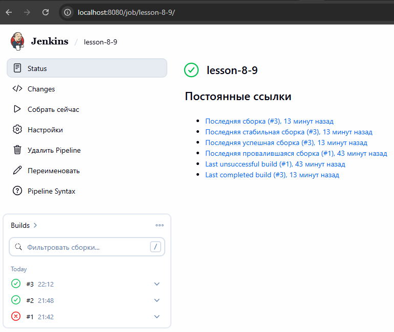
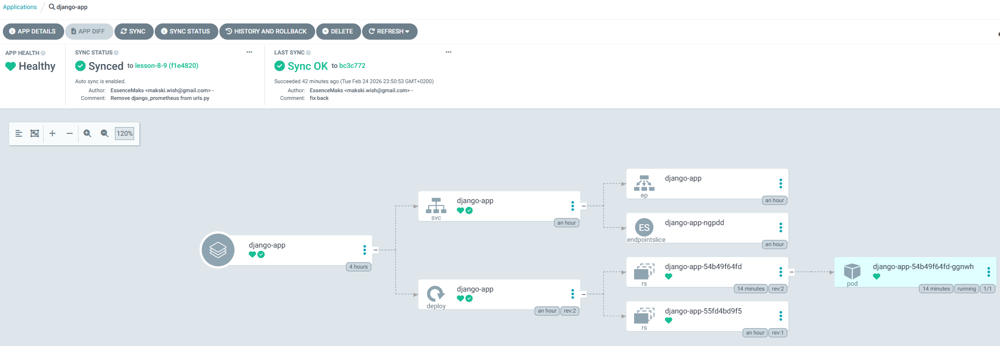
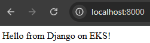
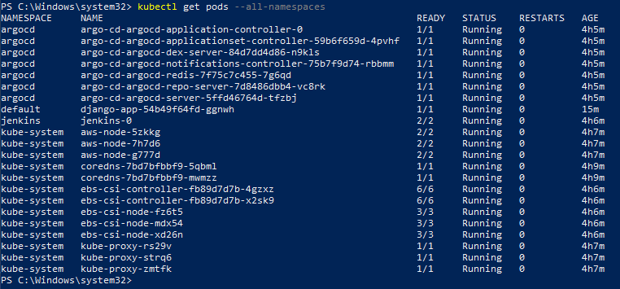

# Final Project: CI/CD з Jenkins + Argo CD + Terraform + Helm

Повний CI/CD pipeline для Django застосунку з автоматичним білдом, деплоєм та синхронізацією через GitOps.

## 📸 Скріншоти (Proof of Work)

1. **Jenkins** — сторінка job `django-app` з успішним білдом (зелена галочка)


2. **Argo CD** — application `django-app` зі статусом Synced / Healthy


3. **Django App** — відкритий у браузері `http://localhost:8000` з текстом "Hello from Django on EKS!"


4. **kubectl** — вивід `kubectl get pods --all-namespaces` (всі поди Running)


---

## ⚠️ AWS Configuration

**Цей проєкт налаштовано на region `eu-central-1`**

- **EKS Nodes**: 3× `t3.small` (2 vCPU, 2 GB RAM)
- **Мережа (VPC)**: Вузли Kubernetes (Worker Nodes) та інші ресурси розміщені частково або повністю в **публічних підмережах** без використання Managed NAT Gateway. Це зроблено **навмисно** виключно з метою економії коштів у рамках цього навчального проєкту (щоб уникнути погодинної оплати за NAT Gateway). У реальному production-середовищі worker-вузли обов'язково повинні знаходитися в приватних підмережах зі строгими правилами доступу та виходом в інтернет через NAT Gateway.

## 🎯 Що реалізовано

### Інфраструктура (Terraform)

- **S3 + DynamoDB**: Backend для Terraform state
- **VPC**: Публічні та приватні підмережі, Internet Gateway, NAT (опціонально)
- **ECR**: Docker registry для образів
- **EKS**: Kubernetes кластер з EBS CSI Driver
- **Jenkins**: CI сервер (Helm) з Kubernetes plugin для динамічних агентів
- **Argo CD**: GitOps CD інструмент (Helm) з автоматичною синхронізацією

### CI/CD Pipeline

1. **Jenkins** збирає Docker образ через **Kaniko** (без Docker-in-Docker)
2. **Jenkins** пушить образ до **ECR**
3. **Argo CD** автоматично виявляє зміни в Git (Helm chart)
4. **Argo CD** синхронізує новий образ в Kubernetes


Паролі до БД, Jenkins та інших компонентів **не зберігаються у відкритому вигляді** в репозиторії. Вони передаються безпечно:
- Під час розгортання інфраструктури Terraform читає логіни та паролі з локального файлу `secrets.tfvars`, який виключено з системи контролю версій (внесено в `.gitignore`).
- Значення для Django DB Credentials (такі як `DATABASE_PASSWORD`) передаються безпосередньо в середовище виконання через Kubernetes Secrets. Вони генеруються або передаються в кластер поза Git-репозиторієм (наприклад, через захищені змінні CI/CD під час `helm` деплою або інші механізми управління секретами), щоб запобігти їх витоку через публічний чи приватний Git.

## 📁 Структура проєкту

```
goit-devops-fp/
├── main.tf                      # Головний Terraform файл
├── backend.tf                   # S3 backend конфігурація
├── outputs.tf                   # Outputs всіх модулів
├── variables.tf                 # Змінні проєкту
├── secrets.tfvars               # Секретні змінні (паролі) — НЕ в Git!
├── Django/                      # Django застосунок
│   ├── Dockerfile               # Docker образ для Django
│   ├── Jenkinsfile              # CI pipeline (Kaniko + ECR)
│   ├── requirements.txt         # Python залежності (django-prometheus)
│   └── myproject/               # Django проєкт
├── modules/                     # Terraform модулі
│   ├── s3-backend/              # S3 + DynamoDB для state
│   ├── vpc/                     # VPC, підмережі, IGW, NAT
│   ├── ecr/                     # ECR репозиторій
│   ├── eks/                     # EKS кластер + EBS CSI Driver
│   ├── jenkins/                 # Jenkins (Helm)
│   ├── argo_cd/                 # Argo CD (Helm) + Applications
│   │   └── charts/              # Helm chart для ArgoCD Applications
└── charts/                      # Helm charts для деплою
    └── django-app/              # Helm chart Django застосунку
        └── templates/
            ├── deployment.yaml
            ├── service.yaml
            ├── configmap.yaml
            ├── secret.yaml
            ├── servicemonitor.yaml  # Prometheus ServiceMonitor
            └── hpa.yaml
```

## 🚀 Інструкція запуску

### Передумови

```powershell
# Перевірте встановлені інструменти
terraform --version   # >= 1.0
aws --version         # AWS CLI v2
kubectl version --client
helm version
git --version

# AWS credentials мають бути налаштовані
aws configure
# Або через змінні середовища: AWS_ACCESS_KEY_ID, AWS_SECRET_ACCESS_KEY
```

### Крок 1: Клонування репозиторію

```powershell
git clone https://github.com/EssenceMaks/GoIT_DevOps.git
cd GoIT_DevOps
git checkout lesson-8-9
```

### Крок 2: Налаштування змінних

Створіть файл `goit-devops-fp/secrets.tfvars`:

```hcl
jenkins_admin_password = "ВашПарольJenkins"
argocd_admin_password  = "ВашПарольArgoCD"
```

Оновіть конфігурації:
- **`Django/Jenkinsfile`** — рядок `registry`: вкажіть ваш ECR URL (`<AWS_ACCOUNT_ID>.dkr.ecr.<REGION>.amazonaws.com/<REPO>`)
- **`modules/argo_cd/charts/values.yaml`** — `repoURL`: URL вашого GitHub репозиторію, `targetRevision`: ваша гілка

### Крок 3: Розгортання інфраструктури

```powershell
cd goit-devops-fp

# 1. Ініціалізація (перший раз — без S3 backend)
terraform init

# 2. Створення S3 backend
terraform apply -target=module.s3_backend -var-file="secrets.tfvars"

# 3. Розкоментуйте backend.tf, потім:
terraform init -migrate-state

# 4. Розгортання всієї інфраструктури (~15-20 хвилин)
terraform apply -var-file="secrets.tfvars"
```

### Крок 4: Підключення до EKS

```powershell
aws eks update-kubeconfig --region eu-central-1 --name <eks-cluster-name>

# Перевірка
kubectl get nodes
kubectl get pods --all-namespaces
```

### Крок 5: Доступ до сервісів (Port-Forwarding)

Відкрийте **окремий термінал** для кожного сервісу:

**Jenkins:**
```powershell
kubectl port-forward svc/jenkins 8080:8080 -n jenkins
# URL: http://localhost:8080
# Login: admin
# Password: (з secrets.tfvars — jenkins_admin_password)
```

**Argo CD:**
```powershell
kubectl port-forward svc/argo-cd-argocd-server 8081:443 -n argocd
# URL: https://localhost:8081
# Login: admin
```
*Отримати пароль ArgoCD:*
```powershell
kubectl -n argocd get secret argocd-initial-admin-secret -o jsonpath="{.data.password}" | % { [System.Text.Encoding]::UTF8.GetString([System.Convert]::FromBase64String($_)) }
```


## ⚙️ Налаштування сервісів після розгортання

### Jenkins — Створення Pipeline та Credentials

#### 1. Створення ECR Credentials

1. Перейдіть: **Manage Jenkins** → **Credentials** → **(global)** → **Add Credentials**
2. **Kind**: `Username with password`
3. **Username**: ваш `AWS_ACCESS_KEY_ID`
4. **Password**: ваш `AWS_SECRET_ACCESS_KEY`
5. **ID**: `ecr-credentials`
6. Натисніть **Create**

#### 2. Створення Pipeline Job

1. На головній сторінці: **New Item** → ім'я: `django-app` → **Pipeline** → OK
2. В секції **Pipeline**:
   - **Definition**: `Pipeline script from SCM`
   - **SCM**: `Git`
   - **Repository URL**: `https://github.com/EssenceMaks/GoIT_DevOps.git`
   - **Branch Specifier**: `*/lesson-8-9`
   - **Script Path**: `goit-devops-fp/Django/Jenkinsfile`
3. Натисніть **Save** → **Build Now**

### Argo CD — Перевірка синхронізації

1. Відкрийте https://localhost:8081
2. Знайдіть application **django-app**
3. Перевірте статус: має бути **Synced** + **Healthy**
4. Якщо **OutOfSync** — натисніть **Sync**


## 🔄 Робочий процес CI/CD

### Як працює автоматичний деплой:

```
Developer pushes code → Jenkins detects → Kaniko builds image → Push to ECR
                                                                     ↓
                              Argo CD syncs ← Git repo updated ← New image tag
                                   ↓
                            Kubernetes updated → Django pod restarted with new image
```

1. Розробник пушить зміни в GitHub
2. Jenkins виявляє зміни та запускає pipeline
3. Kaniko збирає Docker образ всередині Kubernetes (без Docker daemon)
4. Образ пушиться до ECR з тегами `latest` та `BUILD_NUMBER`
5. Argo CD виявляє зміни в Helm chart та синхронізує деплой
6. Kubernetes оновлює под з новою версією образу


## 🔧 Troubleshooting

### Jenkins агент не запускається

```powershell
# Перевірте логи Jenkins
kubectl logs -n jenkins jenkins-0 -c jenkins --tail=50

# Перевірте поди агента
kubectl get pods -n jenkins

# Перевірте сервіс агента
kubectl get svc jenkins-agent -n jenkins
```

### Argo CD показує Degraded

```powershell
# Перевірте поди застосунку
kubectl get pods -n default -l "app.kubernetes.io/name=django-app"
kubectl describe pod <pod-name> -n default
kubectl logs <pod-name> -n default
```


### ImagePullBackOff

```powershell
# Перевірте чи образ існує в ECR
aws ecr describe-images --repository-name final-project-repo --region eu-central-1
```

## 🧹 Очищення ресурсів

```powershell
# ⚠️ ВАЖЛИВО: видаляйте ресурси після тестування щоб уникнути витрат!

cd goit-devops-fp

# Видалення всієї інфраструктури
terraform destroy -var-file="secrets.tfvars"

# ⚠️ Після destroy також видаляється S3 bucket зі state!
# При повторному розгортанні починайте з Кроку 3.
```

## 📚 Додаткові ресурси

- [Jenkins Documentation](https://www.jenkins.io/doc/)
- [Argo CD Documentation](https://argo-cd.readthedocs.io/)
- [Kaniko Documentation](https://github.com/GoogleContainerTools/kaniko)
- [EKS Best Practices](https://aws.github.io/aws-eks-best-practices/)
- [Helm Documentation](https://helm.sh/docs/)
